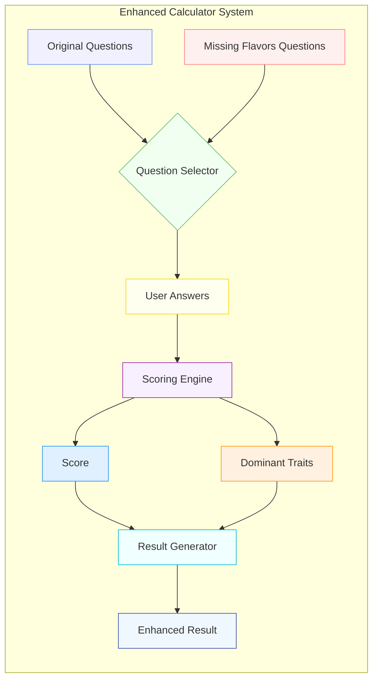

# Missing Flavors Architecture Diagram

The diagram above illustrates how the enhanced calculator system integrates both the original questions and the new "missing flavors" questions. Here's a breakdown of each component:

## 1. Question Sources

- **Original Questions**: The standard question set from `questions.json`
- **Missing Flavors Questions**: The new question set from `questions_missing_flavors.json` that explores emotional numbness, dry friendships, pressureless careers, and calm chaos

## 2. Question Flow

- **Question Selector**: Combines both question sets based on user preferences
- **User Answers**: Captures responses to both original and enhanced questions
- **Scoring Engine**: Processes answers and extracts both scores and personality traits

## 3. Result Generation

- **Score**: Traditional percentage-based score
- **Dominant Traits**: New feature that identifies top personality traits from answers
- **Result Generator**: Combines score and traits to produce enhanced results
- **Enhanced Result**: Final output with traditional score plus trait insights

## Implementation Strategy

To implement this architecture:

1. **Data Layer**:

   - Keep original questions in `questions.json`
   - Store new questions in `questions_missing_flavors.json`
   - Use `questions_enhanced.js` to provide unified access

2. **Processing Layer**:

   - Maintain backward compatibility with original scoring
   - Add trait analysis in `scoring_enhanced.js`
   - Generate enhanced results with trait insights

3. **Presentation Layer**:
   - Allow users to choose between original and enhanced questions
   - Display traditional results plus new trait insights
   - Visualize traits in radar charts or tag clouds

## Benefits

This architecture provides several benefits:

- **Backward Compatibility**: Original calculator functionality is preserved
- **Progressive Enhancement**: New features can be added without breaking existing code
- **Flexible Integration**: Various integration strategies (full replacement, side-by-side, opt-in)
- **Deeper Insights**: Users receive more nuanced and personalized results

By following this architecture, you can seamlessly integrate the "missing flavors" questions while maintaining compatibility with the existing calculator system.
